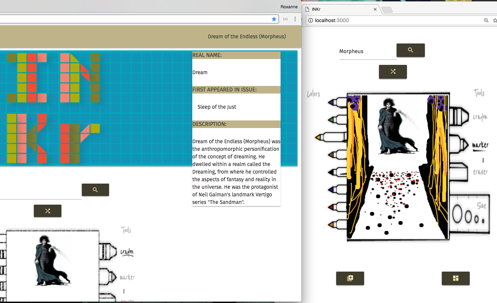
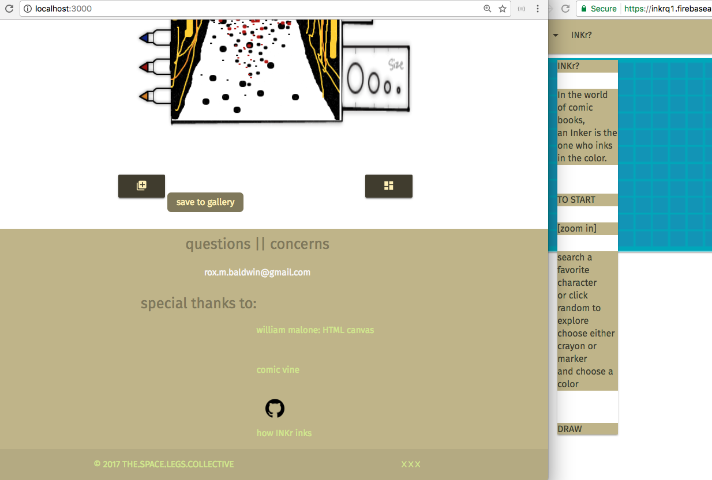

## INKr?:

INKr's primary function is to instill creativity and light-hearted fun while interacting with comic book characters new and known to the user.  An "inker" is a creative role within the creation of a comic book and they ink over the pencils that the penciler drew. INKr will give users the opportunity to creatively interact with comic book characters and act as temporary "inkers" by adding color and form with the original image as a focal point. I kept my design very clean and simple in order to be aesthetically pleasing with the UX focus being the Character Canvas because ,at a fundamental level, it is a drawing app and extraneous design would take away from the UX and connection to the project. Ultimately, my project connects users to nostalgic childhood icons and allow them to discover new characters while expressing themselves creatively.

---
## Demo:

Test the application for yourself at [https://inkrq1.firebaseapp.com](https://inkrq1.firebaseapp.com/)
* The 'Save to Gallery' and 'Your Gallery' features are currently unavailable

Or view a demo video at [DemoVideo](INKrImages/INKrSS2.png)

---
## Features:

* Drawing Tools: crayon or marker
* Color Palette: eight colors to choose from
* Character Canvas: drawing area with comic book character's image
* Specific Character Select
* Random Character Select
* Character Synopsis
* Save to Gallery: saves User's canvas to Gallery [coming soon]
* View Gallery: User can revisit past canvases [coming soon]

---
## Setup:

Fork and clone this repo to your working folder. If you'd like to make CSS changes, be certain that you are running Sass and working in the base.scss file.

To run Sass:
* Make sure you have installed Sass or sudo-installed it
* Open your command line
* Run `sass --watch scss:css`

I recommend using `lite-server` to notice changes as you save your work.

To run Lite-Server:
* Make sure you have installed lite-server
* Open your command line
* Run `lite-server`

---
## Deployment:

* Go to [Firebase](https://firebase.google.com/) and click `GET STARTED`.
* Select `+ add project`
* Create a project
* Open your command line and `install -g firebase tools`
* Run `firebase init` and select default options
* Run `firebase use --add` and arrow down to your Firebase project name that you just made and select
* Run `firebase deploy`
* * to check deployment status and find the applications url, select "Hosting" from Firebase options *

---
## Acknowledgments

* ComicVine API [https://comicvine.gamespot.com/](https://comicvine.gamespot.com/)
* William Malone [www.williammalone.com](http://www.williammalone.com/articles/create-html5-canvas-javascript-drawing-app/)
* Roberto & Matt
